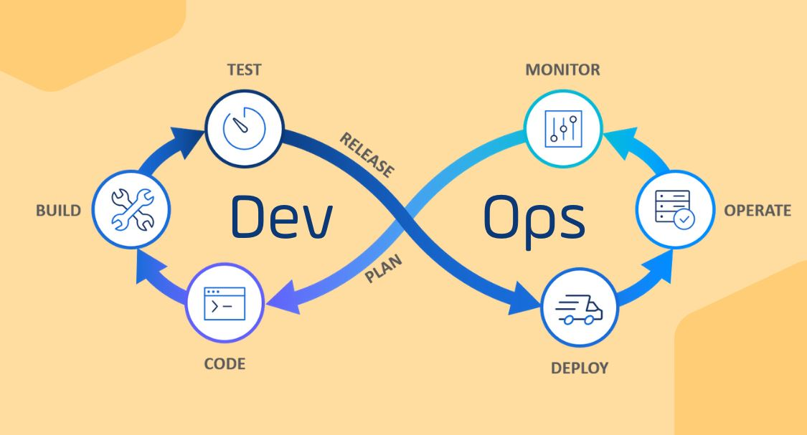

# Angular alapozó kurzus 2023

## TypeScript
- [TypeScript Module](https://github.com/Training360/Angular-basic-2023-typescript)

## Angular Architektúra
- [Architect Module](https://github.com/Training360/Angular-basic-2023-architect)

## Angular Direktívák
- [Directives Module](https://github.com/Training360/Angular-basic-2023-directives)

## RxJS
- [RxJS Module](https://github.com/Training360/RxJS-basic-2023)

## Angular HtttpClient
- [HttpClient Module](https://github.com/Training360/Angular-basic-2023-http)

## Angular Routing
- [Routing Module](https://github.com/Training360/Angular-basic-2023-routing)

## Angular Form
- [Form Module](https://github.com/Training360/Angular-basic-2023-form)

## Angular Reactive Form
- [Reactive Form Module](https://github.com/Training360/Angular-basic-2023-form-reactive)

## Angular Standalone
- [Standalone Module](https://github.com/Training360/Angular-basic-2023-standalone)

## Ngx-bootstrap
- [NgxBootstrap Module](https://github.com/Training360/Angular-basic-2023-ngxbootstrap)

## Projekt modul
- Bevezetés: két projekt áttekintése
  - [User Manager](projects/user-manager)
  - [Webshop](projects/webshop)
- Layout:
  - [AppComponent](projects/webshop/src/app/app.component.ts)
  - [Navigation](projects/webshop/src/app/components/main-navigation/main-navigation.component.ts)
- Adatmodellek:
  - [Model](projects/webshop/src/app/model)
- Szolgáltatások:
  - [Service](projects/webshop/src/app/service)
- Komponensek:
  - [Components](projects/webshop/src/app/components)
  - [GuitarList](projects/webshop/src/app/components/guitars-list/guitars-list.component.ts)
- Routing:
  - [AppRoutingModule](projects/webshop/src/app/app-routing.module.ts)
- Direktívák:
  - [DelayDirective](projects/webshop/src/app/directive/delay.directive.ts)
- Adatok listázása:
  - [GuitarListComponent](projects/webshop/src/app/components/guitars-list/guitars-list.component.ts)
- Összefoglaló

## Publikálás
- Bevezetés:
  - [User Manager](projects/user-manager)
- Build - beállítások:
  - [User Manager](projects/user-manager)
  - `ng build`
- Build - statisztikák:
  - Create script: `"build:stats": "ng build --stats-json",`
  - `npm run build:stats`
  - Analyze script:
  - `"analyze": "webpack-bundle-analyzer dist/user-manager/stats.json",`
- Build - optimalizálás:
  - Bad: `npm i lodash; npm i -D @types/lodash`, `import * as _ from 'lodash';`
  - Good: `npm i lodash-es; npm i -D @types/lodash-es`, `import { cloneDeep } from 'lodash-es';`
- Deploy:

- Github oldal:
  - Github repo létrehozása: `training360.github.io`
  - Repo klónozása a gépre: `git clone <reponame>`
  - Megjegyzés: szükséges lehet az api elérésének módosítása.
    - `ng g environments`
    - [dev](projects/user-manager/src/environments/environment.development.ts)
    - [env](projects/user-manager/src/environments/environment.ts)
    - `apiUrl: 'https://nettuts.hu/jms/joe/',`
    - [UserService](src/app/service/user.service.ts)
    - `baseURL: string = environment.apiUrl; urlFragment: string = 'users2';`
  - Az alkalmazás build-elése: `ng build`
  - A `dist/<appname>` tartalmának feltöltése.
- PHP szerver
  - XAMPP-ot használunk.
  - A base átállítása a build során:
    - `ng build --base-href /angular/`
    - Fájlok másolása a `C:/xampp/htdocs/angular/` mappába.
    - Átnevezés: `index.html` => `index.php`
- NodeJS szerver:
  - NodeJS telepítése (ha szükséges).
  - Express generátor használata:
    - `npm i -g express-generator`
    - `cd app`
    - `npm i`
  - Fájlok másolása az `app/public/` mappába.
  - `node ./bin/www`

